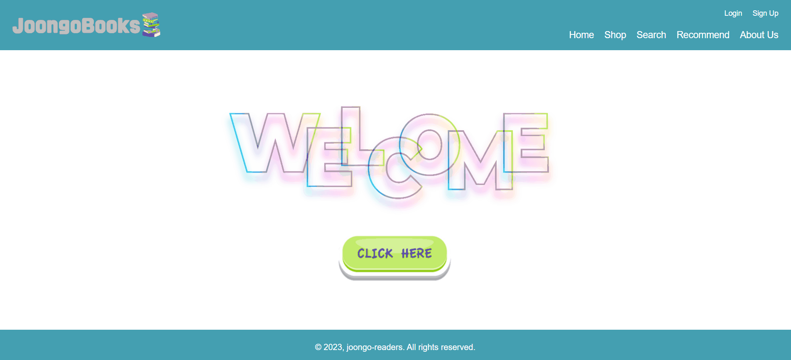
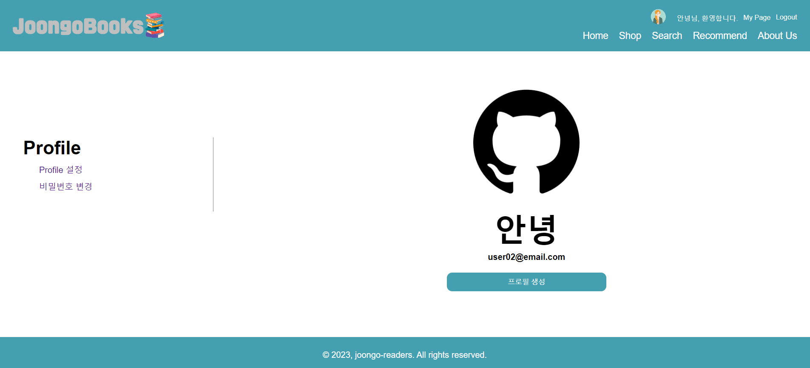
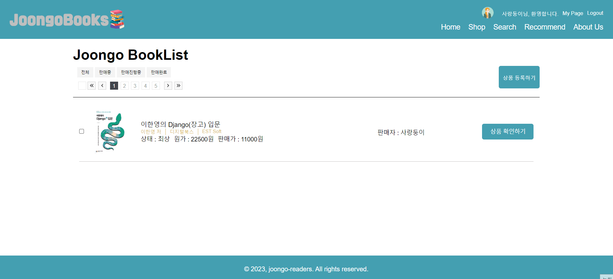
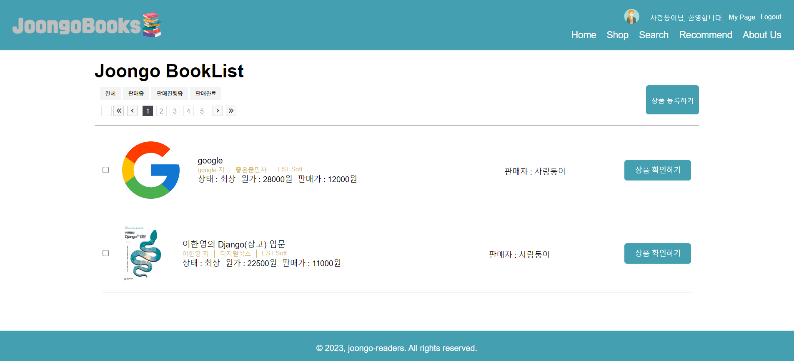
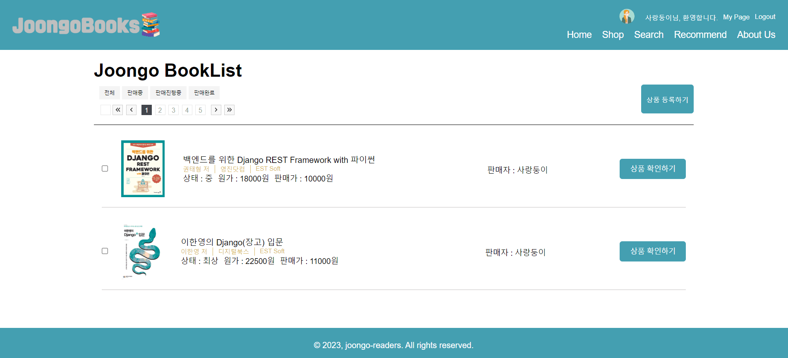

# <div align='center' id='top'> :book: Joogobooks </div>

## 개요

- :dizzy: Joongobooks는 중고도서거래를 위한 서비스입니다.
- :technologist: 더이상 읽지 않거나 필요하지 않은 소장 중인 책을 홈페이지에 등록할 수 있고, 사용자들이 필요로 하는 도서를 찾아 확인 후 구매할 수 있습니다.
- :robot: AI chat-bot을 이용해 책을 추천받는 서비스를 이용할 수 있습니다.

## 목차
1. [프로젝트 목표](#goal)
2. [개발 환경 및 배포 URL](#dev)
3. [프로젝트 구조](#tree)
4. [역할 분담](#role)
5. [개발 기간](#task)
6. [UI](#ui)
7. [페이지 기능](#pages)
8. [개발하며 겪은 이슈](#issues)
9. [마무리](#realization)
10. [고도화 일정](#advancement)

<hr>

## <span id="goal">1. 프로젝트 목표</span>
- 개인이 쉽게 자신의 소장도서를 판매할 수 있는 플랫폼을 제공합니다.
- 등록된 도서 목록을 누구나 쉽게 확인 가능하도록 하여 잠재적인 고객들이 쉽게 접근 가능할 수 있는 플랫폼을 제공합니다.
- 개인의 소장도서를 상품으로 등록하여 수익 창출이 가능할 수 있게 도와주는 온라인 장터입니다.
- openAI 에서 제공한 API를 활용하여 책을 추천하는 AI chatbot을 구현해 책을 추천받을 수 있는 서비스를 제공합니다.

<p align="right"><a href="#top">(Top)</a></p>
<br>

## <span id="dev">2. 개발환경 및 배포 URL</span>
### 개발환경
- Front : HTML, CSS, Vanilla JS
- Back : Python, Django Rest Framework
- openAI api

### 배포 URL
- URL : 🔗http://joongobooks.com

    :rocket: 테스트 ID : admin

<br>

    :rocket: 테스트 Password : admin123!


### 관련 Repository 주소
- BackEnd : https://github.com/silent-readers/joogobooks_back


<p align="right"><a href="#top">(Top)</a></p>
<br>

## <span id="tree">3. 프로젝트 구조</span>


### ERD


### URL

|   앱 이름  |        기능        |                          URL                         | Method |
|:----------:|:------------------:|:----------------------------------------------------:|:------:|
| user       | 회원가입           | 도메인/api/user/register/                             | POST   |
|            | 로그인             | 도메인/api/user/auth/                                 | POST   |
|            | 로그아웃           | 도메인/api/user/auth/                                 | DELETE |
|            | 비밀번호 변경      | 도메인/api/user/auth/<int:user_id>/changepassword/    | PUT    |
|            | 회원탈퇴           | 도메인/api/user/auth/<int:user_id>/delete/            | DELETE |
|            | 프로필 조회        | 도메인/api/user/auth/profile/<int:user_id>/           | GET    |
|            | 프로필 생성        | 도메인/api/user/auth/profile/<int:user_id>/create     | POST   |
|            | 프로필 수정        | 도메인/api/user/auth/profile/<int:user_id>/update     | PUT    |
|            | JWT 토큰 갱신      | 도메인/api/user/auth/refresh/                         | GET    |
|            | JWT 토큰 발급      | 도메인/api/user/api/token/                            | GET    |
| book       | 판매글 리스트      | 도메인/book/list/                                     | GET    |
|            | 판매글 검색        | 도메인/book/search/                                   | GET    |
|            | 판매글 생성        | 도메인/book/create/                                   | POST   |
|            | 판매글 상세보기    | 도메인/book/<int:book_id>/                            | GET    |
|            | 판매글 삭제        | 도메인/book/<int:book_id>/delete/                     | DELETE |
|            | 판매글 좋아요      | 도메인/book/<int:book_id>/like/                       | POST   |
|            | 댓글 달기          | 도메인/book/<int:book_id>/comment/create/             | POST   |
|            | 댓글 삭제          | 도메인/book/<int:book_id>/<int:comment_id>/delete/    | POST   |
| jjim       | 판매글 찜          | 도메인/jjim/create/                                   | POST   |
|            | 판매글 찜 취소     | 도메인/jjim/delete/<int:book_id>/<int:user_id>/        | DELETE |
| recommend  | 책 추천 기록 조회  | 도메인/api/recommend/chatbot/                          | GET    |
|            | 책 추천 받기       | 도메인/api/recommend/chatbot/                         | POST   |

<br>

### 🔗<a href="https://glimmer-velvet-2ce.notion.site/JoongoBooks-API-9f8775a8fb604bdd9f1f1daa7f7a3a93?pvs=4">API 명세서 확인</a>


<br>


### 폴더 Tree
```
joongobooks
├── book
│   ├── migrations
│   ├── admin.py
│   ├── apps.py
│   ├── pagination.py
│   ├── models.py
│   ├── serializers.py
│   ├── tests.py
│   ├── urls.py
│   └── views.py
├── joongobooks
│   ├── asgi.py
│   ├── settings.py
│   ├── urls.py
│   └── wsgi.py
├── media
│   ├── book_image
│   └── profile
├── readme
├── recommend
│   ├── migrations
│   ├── admin.py
│   ├── apps.py
│   ├── models.py
│   ├── serializers.py
│   ├── tests.py
│   ├── urls.py
│   └── views.py
├── user
│   ├── __init__.py
│   ├── admin.py
│   ├── apps.py
│   ├── models.py
│   ├── serializers.py
│   ├── tests.py
│   ├── urls.py
│   └── views.py
├── manage.py
├── README.md
└── requirements.txt
```
<p align="right"><a href="#top">(Top)</a></p>


<br>

## <span id="role">4. 역할 분담</span>


### 구현기능
- 🔐<strong>계정</strong>
    - 회원가입
    - 로그인/로그아웃
    - 프로필 생성/수정
- :computer: <strong>중고도서 정보</strong>
    - 중고도서 이미지 파일 업로드, 미리보기
    - 등록 / 수정 / 삭제
    - 중고도서 목록 보기
- :robot: <strong>AI catbot (recommend)</strong>
    - chatbot 질문하기 / 답변받기
    - 하루 2번 사용가능
<p align="right"><a href="#top">(Top)</a></p>
<br>

## <span id="task">5. 개발 기간</span>
### 개발기간(23.08.17 ~ 23.09.04)


- 🔗<a href="https://glimmer-velvet-2ce.notion.site/1-ba1d7268559a4fd6aebd2ac6d2e7a9d5"> Notion에서 Issue 관리</a>

- 🔗<a href="https://www.notion.so/7337f3775c0d43e5a75959562622ebbf"> 회의록</a>
<p align="right"><a href="#top">(Top)</a></p>
<br>

## <span id="ui">6. UI</span>


<p align="right"><a href="#top">(Top)</a></p>
<br>

## <span id="pages">7. 페이지 기능</span>

| 1. 회원가입 화면 | 2. 로그인 및 로그아웃|
|:---------:|:---------:|
|||

| 3. 프로필 조회 및 생성 | 4. 비밀번호 변경 |
|:---------:|:---------:|
|||


| 5. 도서 목록 조회| 6. 도서정보생성 |
|:---------:|:---------:|
|||

| 7. 도서정보 수정 | 8. 도서정보삭제 |
|:---------:|:---------:|
|||

| 9. 도서정보 검색 | 10. 도서추천 AI Bot |
|:---------:|:---------:|
|||

| 11. About us |
|:---------:|
||

<p align="right"><a href="#top">(Top)</a></p>
<br>

## <span id="issues">8. 개발하며 겪은 이슈</span>
- 슬기님
1. DRF SimpleJWT 사용 중 register(회원가입)에서 HTTP_401_error 발생
    - 내용
        - POSTMAN을 통해 POST http://{localhost}/api/user/register/ 설정하고 body에 username, email, password 를 담아 send를 했지만 401 error를 마주하게 되었다.
        - 회원 가입 구간에서는 인증 권한이 필요하지 않는데 401 에러가 나와 당황했다. 
    - 결과
        - settings.py를 살펴보던 중 'DEFAULT_PERMISSION_CLASSES’에 'rest_framework.permissions.IsAuthenticated’ 를 설정한 것을 확인했다.
        - 이 기능은 전역으로 적용되기 때문에 views.py에서 각 클래스별로 설정해 줄 필요가 있다고 생각했다.
        - user의 views.py 에서 UserRegisterAPIView 클래스에 permission_classes 를 추가해서 권한을 AllowAny로 설정했다.
        - POSTMAN 에서 POST 설정 후 body에 정보를 담아 다시 send 해주니 이번에는 제대로 동작하여 HTTP_200_ok 를 출력받았다.
<br>

2. Signup, login 에서 server로 연결 안됨
    - 내용
        - fetch url 사용하여 Backend 서버로 연결하여 request 및 response 받기 위해 시도를 했다.
        - 하지만 server로 부터 어떤 response도 받지 못하는 현상이 발생했다.
        - console.log에서 error 메세지를 확인하고 싶었지만 특별한 문제로 인식되지 않았는지 error 메세지가 나오지 않았다.
    - 결과
        - url의 문제도 아닌 것 같아 고민하다가 signup, login button에서 .addEventListener를 사용하고 있음을 확인했다.
        - button click 시 submit event가 기본적으로 일어나면서 페이지 이동 현상이 발생하게 되는데 그로 인해 fetch를 통해 서버로부터 response를 얻지 못한다는 것을 알게 되었다.
        - 원하는 코드 진행을 위해 e.preventDefault(); 코드를 첫 단에 입력하였고 그 후에 response 값을 받을 수 있었다.
<br>

3. server를 통해 저장된 media file을 가져올 때 화면에 구현되지 않는 error
    - 내용
        - fetch api request를 통해 중고 도서가 등록된 후 도서목록에서 등록된 도서들을 확인할 수 있었다. 하지만 다른 정보들은 잘 넘어오는 반면 img 파일은 넘어오지 못하는 현상을 발견했다.
        
        - 서버에서 GET method를 통해 가져올 때 media와 관련된 url이 필요하다고 생각하고 ‘http://localhost:8000’ 을 추가해줬다. 하지만 url 구문을 완성해서 특정 media img file에 대한 GET 요청을 진행해도 [alt=”작성된 문자”] 만 보였다.
    - 결과
        - HTTP_404_error에 집중해보기로 했다.
        ```
                
        💡 **원인**

        웹 서버는 요청된 페이지를 검색할 수 없을 때 **HTTP 404 - 파일을 찾을 수 없음** 오류 메시지를 반환합니다.

        다음은 이 오류 메시지의 몇 가지 일반적인 원인입니다.

        - 요청한 파일의 이름이 변경되었습니다.
        - 요청한 파일이 다른 위치로 이동 및/또는 삭제되었습니다.
        - 요청한 파일은 유지 관리, 업그레이드 또는 기타 알 수 없는 원인으로 인해 일시적으로 사용할 수 없습니다.
        - 요청한 파일이 없습니다.
        - IIS 6.0: 적절한 웹 서비스 확장 또는 MIME 유형이 사용되지 않습니다.
        - 가상 디렉터리가 다른 서버의 드라이브 루트에 매핑됩니다.

        **해결 방법**

        이 문제를 해결하려면 브라우저의 URL에서 요청한 파일이 IIS 컴퓨터에 있고 올바른 위치에 있는지 확인합니다.

        IIS MMC(Microsoft Management Console) 스냅인을 사용하여 IIS 컴퓨터의 파일 시스템에서 요청된 파일이 있어야 하는 위치를 확인합니다.

        이것은 웹 사이트에서 VDIR(가상 디렉터리)을 사용하는 경우 중요합니다. VDIR은 웹 사이트의 홈 디렉토리에 포함되어 있지 않지만 클라이언트 브라우저에 있는 것처럼 보이는 디렉토리입니다. 이 가상 디렉터리는 드라이브의 하위 폴더에 매핑되거나 이름으로 파일을 참조해야 합니다.

        예를 들어, 404 오류를 일으킨 URL이 `http://Microsoft.Com/Test/File1.htm`이고 IIS 스냅인이 Microsoft.Com 웹 사이트인 경우, /Test/ 디렉터리는 실제로 IIS 컴퓨터의 c:\Information 위치에 매핑되는 가상 디렉터리입니다. 즉, File1.htm 파일이 c:\Information 디렉터리에 있는지 그리고 파일 이름의 철자가 올바른지 확인해야 합니다.

        IIS 동적 콘텐츠: W3C 확장 로그 파일의 404.2 항목은 웹 확장이 활성화되어 있지 않을 때 기록됩니다. IIS MMC(Microsoft Management Console) 스냅인을 사용하여 적절한 웹 확장을 사용하도록 설정합니다. 기본 웹 확장에는 ASP, ASP.NET, Server-Side Include, WebDAV 게시, FrontPage Server Extensions, CGI(Common Gateway Interface)가 포함됩니다. 사용자 지정 확장을 추가하고 명시적으로 활성화해야 합니다. 자세한 내용은 IIS 도움말 파일을 참조하세요.

        IIS 정적 콘텐츠: 확장이 MIME 맵 속성의 알려진 확장에 매핑되지 않은 경우 W3C 확장 로그 파일의 404.3 항목이 기록됩니다. IIS MMC(Microsoft Management Console) 스냅인을 사용하여 MIME 맵에서 적절한 확장을 구성합니다. 자세한 내용은 IIS 도움말 파일을 참조하세요.

        이 오류 메시지의 덜 일반적인 다른 원인에 대한 자세한 내용은 [IIS 숨겨진 정적 파일이 HTTP 404를 반환하거나 액세스 거부 오류](https://learn.microsoft.com/ko-kr/troubleshoot/iis/hidden-static-files-http-404-access-denied)를 참조하세요.
        ```
        - url 주소는 정확하지만 왜 server가 이 요청에 대해 정확히 인식하지 못하는지 BackEnd 부분에 집중해보기로 했다.
        - 열심히 코드들을 훑어보던 중 프로젝트/urls.py에 media 폴더에 담긴 파일들을 이용하기 위해 작성해야 할 코드를 빼먹었단 사실을 깨달았다.
        ```
        # 추가적으로 작성해줬어야 하는 코드
        + static(settings.MEDIA_URL, document_root=settings.MEDIA_ROOT)

        # 수정한 코드
        from django.contrib import admin
        from django.urls import path, include
        from django.views.generic import RedirectView

        from django.conf import settings
        from django.conf.urls.static import static

        urlpatterns = [
            path('admin/', admin.site.urls),
            path('api/user/', include('user.urls')),
            path('book/', include('book.urls')),
            path('jjim/', include('jjim.urls')),
            path('api/chat/', include('chat.urls')),
        ] + static(settings.MEDIA_URL, document_root=settings.MEDIA_ROOT)
        ```
        - media img 파일과 관련된 .js 파일에도 media 파일의 url을 정확하게 지정해주고 다시 실행해보니 책 목록, 상세페이지 등 media 파일을 이용하는 부분에서 정확하게 파일이 화면에 잘 구현되어 보여지는 것을 확인했다.

- 승겸님
1. 프로필 생성 기능 구현과정에서 Profile 데이터베이스에 저장되지 않는 문제 발생
    - 이슈: 프로필 생성기능에서 post 방식으로 ProfileSerializer 형식에 데이터가 맞을 경우 201 Response를 보내면서 profile 데이터베이스에 저장되어야 하는데
    결과반응은 잘 나오나 GET 방식으로 proifile 데이터베이스의 값을 확인해본 결과, 연동되지 않았는지 데이터가 저장되지 않는 문제가 발생하였다.
    
    

    - 해결: Profileserializer의 create 메서드와 ProfileCreateView의 post메서드간에 충돌이 생겨 데이터베이스 연결이 꼬인것이 원인인듯 하여 ProfileSerializer에서 profile 데이터를 생성하는 메서드를 넣어줬었는데 그 메서드를 serializer에서 제외하고 views.py ProfileCreateView post메서드안에 그 기능을 넣어주었더니 정상적으로 profile 데이터베이스에 저장되었다.
    ```
        profile = Profile.objects.create(
                user=user_instance,
                profile_img=profile_img,
                about_me=about_me
            )
    ```

2. 도서 정보 생성 기능 구현과정에서 에러 발생
    - 이슈: book_id와 user_id를 받아 Jjim 데이터베이스에 저장하는 도서정보 생성 기능 구현과정에서 데이터를 입력받았을 때, 다음과 같은 에러가 발생하였다.
        jjim.models.Jjim.MultipleObjectsReturned: get() returned more than one Jjim -- it returned 2!

    - 해결: Jjim 레코드가 동일한 'user_id'와 'book_id'조건으로 검색되었을 때, 발생하는 오류로 중복되는 레코드가 있는 경우 발생하는 것이라고 한다.
        이것을 해결하려면 중복되는 레코드를 방지하거나 처리해야하는데, filter()메서드를 통해 처리가 가능하므로 다음과 같은 코드를 넣어 중복된레코드를 처리하여 오류를 해결하였다.
        ```
            jjim = Jjim.objects.filter(user_id=user_id, book_id=book_id).first()
        ```

- 유림님
    - bookSearchView를 만들면서 카테고리 설정과 키워드 검색을 동시에 적용한 결과를 만들고 싶었는데, Search와 DjangoFilterBackend를 하나의 검색버튼으로 동시에 적용시킬 수 없었습니다. 그리고 검색을 filter를 사용해서 하자니 이름이 일치하는 것들만 결과물로 나와서, BookSearchFilter를 새로 만들어 적용시켰습니다. FilterSet을 상속받되, 책 제목을 검색할 때 키워드를 포함하는 모든 결과물들을 가지고 올 수 있도록 title은 icontains, sale_condition은 exact 필드를 사용하였습니다.
 
<br>

- 병훈님
1. 글 수정 및 삭제 시 작성자가 아니어도 수정 및 삭제가 되는 현상 발생
    - 내용
        - 권한 설정 시 IsAuthenticated만 적용되어 있는 부분 확인
    - 결과
        - request.user와 book.user가 같을 시 권한을 주는 IsBookAuthor 클래스를 생성하여 해결.
<br>
     
2. 데스크톱에서 EC2 서버로 파일 전송 시 'Permission Denied' 에러 발생
    - 내용
        - 데스크톱에서 EC2 서버로 scp를 사용하여 파일을 전송하려 했지만, 'Permission Denied'오류 발생.
    - 결과
        - 키 페어 속성 - 보안 - 고급에서 ‘상속 사용 안 함’ 클릭 후 ‘이 개체에서 상속된 사용 권한을 모두 제거합니다.’ 클릭 후 저장, 편집 - 추가 - 데스크톱 계정 추가
   
<br>

3. Backend 서버에서 requirements.txt 설치 중 오류 발생
    - 내용
        - 가상환경 venv를 생성 후, requirements.txt 설치 도중 'Building wheels for collected packages: twisted-iocpsupport'오류가 발생하였다.
        - Windows 환경에서는 잘 작동했는데, 오류가 발생해서 원인을 찾아보았다.
    - 결과
        - 'twisted-iocpsupport'는 Window 환경에서 사용하는 패키지로, Windows "I/O completion Ports" API에 바인딩을 제공하는 패키지다.
        - Linux 환경에서는 사용하지 않기 때문에 requirements.txt에서 제거하였다.
<br>

4. Docker 이미지 빌드 시 권한 오류 발생
    - 내용
        - Dockerfile 작성 후, 빌드를 시도했으나, 'permission denied'에러가 반환됨.
    - 결과
        - 사용자를 'docker'그룹에 추가하여 관리자 권한 없이 실행할 수 있게 조치
        - 'sudo usermod -aG docker $USER' 입력 후, 다시 로그인하여 sudo를 사용하지 않고 Docker 실행 가능.
<br>

5. 'ModuleNotFoundError: No module named 'psycopg' 에러 발생
    - 내용
        - DB연동 후 서버 구동을 시도했으나, ModuleNotFoundError: No module named 'psycopg' 에러 발생.
    - 결과
        - PostgreSQL과 Django를 연결하는 모듈인 psycopg2-binary 모듈이 없어서 발생한 문제.
        - requirements.txt에 psycopg2-binary를 추가하여 해결.
<br>

6. Route53에서 구매한 도메인 S3버킷에 적용 안되는 현상
    - 내용
        - Route53에서 구매한 도메인이 EC2에는 적용되는데, S3에는 적용이 되지 않는 문제가 발생했다.
    - 결과
       - S3 버킷명을 도메인과 똑같이 "joongobooks.com"으로 설정하여 해결
<br>

- 예원님
  - 이슈 : SystemCheckError: System check identified some issues 에러 발생
  - 해결 : auth.User.groups 와 user.User.groups가 충돌해서 발생한 에러였고, 원인을 찾아보니, 두 모델이 공통된 필드를 가지고 있기에 발생하는 충돌이었다. related_name을 추가하여 충돌을 방지하도록 하고, settings.py에서 기존 USER 모델 대신 새로 정의한 USER 모델을 사용하도록 AUTH_USER_MODEL 설정을 추가했다.
<p align="right"><a href="#top">(Top)</a></p>
<br>

## <span id="realization">9. 마무리</span>
- 슬기님
    - 이번 프로젝트를 통해 Django에 대해 더 자세히 알게 된 것 같습니다. 생각보다 많은 기능들을 Django가 품고 있다는 것을 알게 되어서 신기하고 반갑고 설렜습니다. 하지만 기술 구현 skill이 부족해서 프로젝트 기간동안 욕심 냈던 부분에 비해 너무 미약한 결과만 나타낸 것 같아 아쉬운 마음이 큽니다. 그래서 프로젝트 고도화를 꼭 진행하고 싶습니다. 먼저 계획해서 구현하고 싶었던 기능인 1:1 채팅 뿐만 아니라 현재 구현된 AI recommend 부분도 발전 시켜서 더 정확한 책 추천 기능을 만들고 싶습니다. 마지막으로 부족함에도 불구하고 이번 팀 프로젝트의 총괄을 맡게 되었는데 그런 저를 믿고 따라준 우리 팀원들에게 진심으로 감사하다는 말 꼭 전하고 싶습니다. 프로젝트 기간동안 너무 수고 많으셨습니다!
- 승겸님
    - 처음으로 해본 팀 프로젝트였습니다. 초기에는 팀원들과 환경설정과 커밋컨벤션 맞추기, git branch따서 작업하는 일등 모든 것이 낯설었고 사소한 오류에 헤메기도했지만 하나씩 해결해나가면서 팀프로젝트에 적응해나갔고, 기능을 만들어갈때마다 뿌듯함을 느꼈습니다. 지금은 자연스럽게 PR을 할 수 있지만 불과 2주 전만해도 힘겹게 했던 것을 생각하면 정말 제 자신이 놀라울정도로 많이 발전했다는 것을 느끼게되었습니다. 이렇게 제가 발전할 수 있었던 것은 저 혼자만이 해결한 것이 아닌 팀원분들이 도와줬기에 가능한 일이라고 생각합니다. 어려운부분을 팀원들과 서로 공유하면서 해결점을 찾고 개선해 나가니까 혼자서 끙끙대며 해결하는 것에 비해 시간도 단축되고 더 많이 배울 수 있었습니다. 이러한 경험을 통해 개발에서 협업이라는 것이 왜 중요한지에 대해 몸소 느끼게되었고, 앞으로도 개인프로젝트보다는 팀프로젝트로 다양한 경험을 쌓아보고 싶습니다.
- 유림님
    - 짧은 기간의 프로젝트에서 기획부터 배포까지 진행하려니 시간이 촉박했지만, 온전히 프로젝트에 집중해서 단기간에 Django 실력을 늘린 것 같아 뿌듯합니다! 이번 프로젝트를 통해 Django도, Github로 협력하는 법도 많이 배워가는 것 같습니다. 처음에 기획했던 기능 구현을 프로젝트 기간 내 다 하지 못한 것은 아쉽지만, 추후에도 기능을 계속 업데이트 해 나가서 보다 완성도있는 프로젝트가 되게 할 예정입니다. 이 프로젝트를 위해 열심히 임해준 팀원들에게 너무 감사합니다!
- 병훈님
    - 팀원들과 같이 파트를 나누어서 협업을 하는 과정이 너무 즐거웠습니다. 특히 컨벤션을 정해서 다 같이 하나의 서비스를 구성해 나가는 부분과, 혼자 개발했다면 시도하기 쉽지 않은 기능들을 구현할 수 있어서 좋았습니다. DRF 부분에 있어서는 지식이 없어서 처음에 막막했지만, 팀원들과 스터디를 함께 하며 결국 서비스를 만들어 냈다는 사실이 너무 뿌듯하고 자랑스럽습니다. 정말 큰 성장을 하게 된 프로젝트였고, 마지막까지 낙오 없이 같이 달려온 팀원들이 정말 자랑스럽습니다!
- 예원님
   - 처음으로 해본 협업이라 많이 미숙한 점도 많았고, 시간도 부족해서 더 많은 것들을 구현하지는 못했다는 아쉬움이 남지만, 이번 프로젝트를 하면서 Django, html, css에 집중할 수 있어서 좋았습니다. 어떻게 구현해야할지 방향성을 고민하고, 방법을 찾아보고 하는 과정이 저의 자양분이 되었으리라 생각합니다. 시간이 부족해서 구현하지 못한 내용들은 앞으로 시간을 갖고 차차 채워나갈 것입니다. 앞으로도 다른 팀 프로젝트에 도전하면서 제 실력을 향상시키고자 하는 의지가 생겼습니다. 이번 프로젝트는 제게 다른 분들과 해본 만큼 저의 실력이 아직 나아갈 곳이 많고, 부족한 면이 많다는 것과 개발의 매력을 알려주어 앞으로도 열심히 하는데 동기부여가 될 것 같습니다. 그리고 저를 도와주시고, 함께 해주시느라 고생한 팀원분들께 정말 감사하다는 인사 남기고 싶습니다.

<p align="right"><a href="#top">(Top)</a></p>
<br>

## <span id="advancement">10. 고도화 일정 </span>

<p align="right"><a href="#top">(Top)</a></p>
<br>
